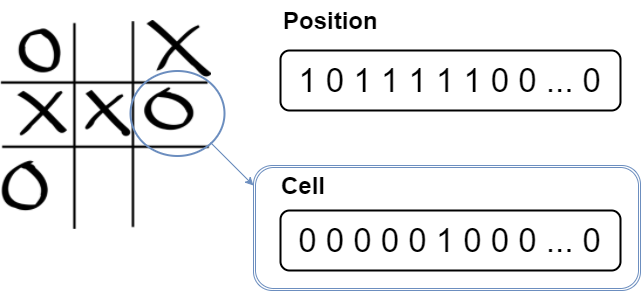

# Absolute position

Now we can find ourselves in a 2D board, we will see how to **access** and **modify** cells.

First of all, we will study how to use cartesian coordinates (x,y) with **absolute position**. In the next chapter, we will do the same thing using **relative position** this time.

To well understand how to deal with absolute positioning, we will see:
- How to [define a cell with absolute coordinates](#cells-and-absolute)
- How to [get a cell value](#get-cell)
- How to [set a cell value](#set-cell)

**Reminder**: in this tutorial (which uses C++), the `Bitboard` type has been defined as an unsigned 64bits integer (corresponding to the `uint64_t` type)

# <a name="cells-and-absolute"></a>  Cells and absolute positioning

We have said that a position is of type `Bitboard`. So how is defined a cell ?

Response is... a Bitboard ! Yes, that's pretty confusing.

> _I don't get the difference ?_

In fact a bitboard representing a cell is a sequence with only **1 bit at 1** and **the other at 0**. This type of binary vector is often used in different computing domains and is called "**one-hot encoding**".



# <a name="get-cell"></a> Getting cell value

Now we simply want to transform (x,y) to bit position and vice-versa.

#### Cartesian coordinates and bit position

The formula is quite simple and is highly used when working with 1D vector instead of 2D arrays.

```math
\begin{equation}
  \tag{Cartesian to bit position}
  bitpos = y * W + x
\end{equation}
```

Alternatively, we can deduce the cartesian coordinates from the bit position. The following formula is the direct inverse of the above:

```math
\begin{equation}
  \tag{Bit position to cartesian}
    \left \{
    \begin{array}{l l l}
      x  & = & bitpos & \mod & W \\
      y  & = & bitpos & \div & W
    \end{array}
    \right .
\end{equation}
```

At this point we know all the necessary conversions from bit position to (x,y) coordinates. We can now begin to write our engine methods.

#### Get value

Now that we know how are defined position and cells, we want to get the value at a position (x,y).

We will make it in two steps:
1. Define the cell: create a one-hot vector with one bit set to 1 at bitpos, and the others at 0.
2. Make a **bitwise-AND** between the cell and the board

If the resulting bitboard is **equal to 0**, the **value at bitpos is 0**

Otherwise, if it is **equal to 1**, the **value at bitpos is 1**

```math
bitboard = bitboard \wedge (1 \ll bitpos)
```

The resulting function should look as following:

```C++
bool getCell(Bitboard position, int x, int y) {
    return position & (1 << y*3+x);
}
```


# <a name="set-cell"></a> Setting cell value

## Activating a bit

We want to **add** an element at (x,y) coordinates. In other words: we want to set the **bit n° _bitpos_ at 1**.

We will make it in two steps:
1. Define the cell: create a one-hot vector with one bit set to 1 at bitpos, and the others at 0.
2. Make a **bitwise-OR** between the cell and the board
<br/>

```math
bitboard = bitboard \vee (1 \ll bitpos)
```

We can write it up:

```C++
Bitboard setCell(Bitboard bitboard, int x, int y) {
    return bitboard | (1 << (y * 3 + x));
}
```

## Clearing a bit

We want to **remove** an element at (x,y) coordinates. In other words: we want to set the **bit n° _bitpos_ at 0**.

We will make it in two steps:
1. Define the cell: create a one-hot vector with one bit set to 1 at bitpos, and the others at 0.
2. Make a **bitwise-AND** between the **bitwise-NOT** of cell and the board
<br/>


```math
bitboard = bitboard \wedge \mathord{\sim}(1 \ll bitpos)
```

See the `~` thing in the formula ? This is the bitwise-NOT. We can write it up:

```C++
Bitboard clearCell(Bitboard bitboard, int x, int y) {
    return bitboard & ~(1 << (y * 3 + x));
}
```


# Switching value

We want to **switch** the value at (x,y) coordinates. In other words: **if the bit is 1, we want it to 0. Otherwise, we want it to 1**.

```math
bitboard = bitboard \oplus (1 \ll bitpos)
```

We can write it up:

```C++
Bitboard switchCell(Bitboard bitboard, int x, int y) {
    return bitboard ^ (1 << (y * 3 + x));
}
```

# Swapping values

We want to **swap** values between (x1,y1) and (x2,y2) coordinates. In other words: we want to **exchange the value of bit n° bitpos1 with the value of bit n° bitpos2**.

We can easily do this with by using our function "switch". It gives:

```math
bitboard = bitboard \oplus (1 \ll bitpos1) \oplus (1 \ll bitpos2)
```

We can write it up:

```C++
Bitboard swapCells(Bitboard position, int x1, int y1, int x2, int y2) {
    return position ^ (1 << (y2 * 3 + x2)) ^ (1 << (y1 * 3 + x1));
}
```

    **Application**
    
    Consider

# Playground

```C++ runnable
#include <cstdio>
#include <cstdint>

typedef uint64_t Bitboard;
typedef struct StateSt {
  // autofold {
    int player;
    Bitboard board; // all tiles: (0 for empty, 1 for existing tile)
    Bitboard position; // current player tiles: (0 for empty, 1 for existing tile)
    StateSt() : player(0), board(0), position(0) {}
  // }
} State;
namespace Utils {
  // autofold {

    void display(Bitboard position) {
        int i,j;
        Bitboard currPosition = position;

        printf("Bitboard display:\n\n");
        for(i=0; i < 3; i++) {
            for ( j = 0; j < 3; j++) {
                printf((currPosition & 0x01) ? "1" : "0");
                currPosition >>= 1;
            }
        }
        printf("\n\n");
    }

    void displayPretty(Bitboard position) {
        char symb;
        int i,j;
        Bitboard currPosition = position;

        printf("Bitboard pretty display:\n\n");
        printf("   |");
        for (j = 0; j < 3; j++)
            printf(" %d |", j);
        printf("\n");
        for (j=0; j<4; j++)
            printf("----");
        printf("\n");
        for(i=0; i < 3; i++) {
            printf(" %d |", i);
            for ( j = 0; j < 3; j++) {
                printf(" %c |", (currPosition & 0x01) ? 'X' : '.');
                currPosition >>= 1;
            }
            printf("\n");
            for (j=0; j<4; j++)
                printf("----");
            printf("\n");
        }
        printf("\n");

  }

// }
}

bool getCell(Bitboard position, int x, int y) {
    return position & (1 << y*3+x);
}

Bitboard activateCell(Bitboard position, int x, int y) {
    return position | (1 << (y*3+x));
}

Bitboard clearCell(Bitboard position, int x, int y) {
    return position & ~(1 << (y*3+x));
}

Bitboard switchCell(Bitboard position, int x, int y) {
    return position ^ (1 << y * 3 + x);
}

Bitboard swapCells(Bitboard position, int x1, int y1, int x2, int y2) {
    return position ^ (1 << (y2 * 3 + x2)) ^ (1 << (y1 * 3 + x1));
}

int main() {
    State state;
    state.board = 27;

    Utils::displayPretty(state.board);
    printf("value at (x=0,y=0): %d\n", getCell(state.board,0,0));
    printf("value at (x=1,y=0): %d\n", getCell(state.board,1,0));
    printf("value at (x=2,y=0): %d\n\n", getCell(state.board,2,0));

    state.board = clearCell(state.board,0,0);

    printf("clean at (x=0,y=0): %d\n\n", getCell(state.board,0,0));
    Utils::displayPretty(state.board);

    state.board = activateCell(state.board,2,0);

    printf("activate at (x=2,y=0). New value: %d\n\n", getCell(state.board,2,0));
    Utils::displayPretty(state.board);
    
    state.board = switchCell(state.board,1,1);

    printf("switch at (x=1,y=1). New value: %d\n\n", getCell(state.board,1,1));
    Utils::displayPretty(state.board);

    state.board = swapCells(state.board,0,0,2,0);

    printf("swap between (x=0,y=0) and (x=2,y=0)\n\n");
    Utils::displayPretty(state.board);
}
```

# What has been done so far
