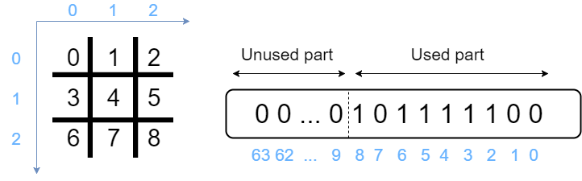

# II.1 Board and position

In the previous chapter, **we used a 3x3 board** according to the Tic-Tac-Toe rules.

Be `N = HEIGHT * WIDTH` the number of cells of the board. Considering the integers we use have **exactly 64 bits**, we can ask ourselves:

* How to handle board with **N < 64** ?
* How to handle board with **N > 64** ?

Before answering this question, we should see **how bits are numeroted in 2D space**.

# Bits position in 2D space with N <= 64

In this tutorial, we use the **Big Endian notation**. All the formulas you will read later will entirely depends on this frame of reference.

::: Reminder: Endianness

**Big Endian** notation: the first bit is the biggest. 
```math
1101_{(2)} = 1*2^3 + 1*2^2 + 0*2^1 + 1*2^0 = 13_{(10)}
```

**Little Endian** notation: the last bit is the biggest 
```math
1101_{(2)} = 1*2^0 + 1*2^1 + 0*2^2 + 1*2^3 = 11_{(10)}
```
:::

Reading the **bits from right to left** corresponds to reading the **2D cells from left to right and from top to bottom**



Using cartesian coordinates (x,y), we can observe that:
* The coordinates (0,0) corresponds to the bit n°0
* The coordinates (1,0) corresponds to the bit n°1
* The coordinates (1,1) corresponds to the bit n°4
* The coordinates (2,2) corresponds to the bit n°8

As shown in the above image, in the cases where the board is `N < 64`, we can still work by simply setting the remaining **unused bits to zero**.


# Bits position with N > 64

We're not going to study this case. However, you should know that bitboards can potentially **represent every 2D boards** regardless of the board size, using a method called **layers**.

## Layers

Layers consist in a list of unsigned 64bits integers. For example, if you need to represent a [Draughts](https://en.wikipedia.org/wiki/Draughts) board which is `N = 10x10 = 100 cells`, you will need two integers (128 bits).

```math
nbLayers = \ceil{N / 64}
```

# Displaying board and position

In the following sections, we will keep our **Tic-Tac-Toe** example. We will also need to display Bitboards if we want to well understand the different operations. Two type of displays will be useful:
* a simple display, that shows the **binary sequence**
* a pretty display, that shows the **board representation**

You are lucky, I already prepared these functions. In the following code, you get the state structure written in the previous section, and two functions `Utils::display(Bitboard position)` and `Utils::displayPretty(Bitboard position)`.

Display the board and try to change the `state.board` to get different positions.

```C++ runnable
#include <cstdio>
#include <cstdint>

typedef uint64_t Bitboard;

typedef struct StateSt {
  // autofold {
    int player;
    Bitboard board; // all tiles: (0 for empty, 1 for existing tile)
    Bitboard position; // current player tiles: (0 for empty, 1 for existing tile)
    StateSt() : player(0), board(0), position(0) {}
  // }
} State;

namespace Utils {
  // autofold {

    void display(Bitboard position) {
        int i,j;
        Bitboard currPosition = position;

        printf("Bitboard display:\n\n");
        for(i=0; i < 3; i++) {
            for ( j = 0; j < 3; j++) {
                printf((currPosition & 0x100) ? "1" : "0");
                currPosition <<= 1;
            }
        }
        printf("\n\n");
    }

    void displayPretty(Bitboard position) {
        char symb;
        int i,j;
        Bitboard currPosition = position;

        printf("Bitboard pretty display:\n\n");
        printf("   |");
        for (j = 0; j < 3; j++)
            printf(" %d |", j);
        printf("\n");
        for (j=0; j<4; j++)
            printf("----");
        printf("\n");
        for(i=0; i < 3; i++) {
            printf(" %d |", i);
            for ( j = 0; j < 3; j++) {
                printf(" %c |", (currPosition & 0x01) ? 'X' : '.');
                currPosition >>= 1;
            }
            printf("\n");
            for (j=0; j<4; j++)
                printf("----");
            printf("\n");
        }
        printf("\n");

  }

// }
}

int main() {
    State state;
    state.board = 27;

    Utils::displayPretty(state.board);
    Utils::display(state.board);
}
```

Now we have all the required knowledges and tools to bitboards manipulation. 

Let's make our first step in the next part.
