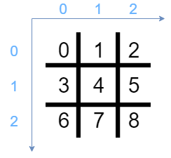
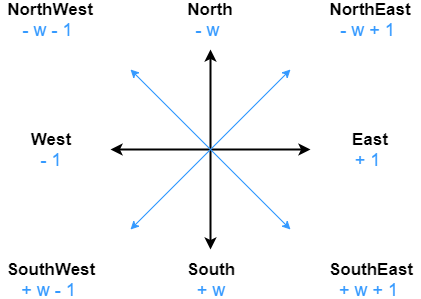

# Handling coordinates

We have just seen that a cell can be defined by the **position of the bit** on the bitboard. In fact, by using bitboards you will need to deal with three different coordinates:
* **Bit position** that we talked about in the previous chapter
* **Cartesian coordinates** (x,y), that you should all know about
* The **one-hot vectors**, less known but no less important

# Cartesian coordinates (x,y)

We have already talked about it in the previous chapter, so we will just show how can we make conversion from (x,y) to bit position and vice versa.



## Bit position conversion

The formula is quite simple and is highly used when working with 1D vector instead of 2D arrays.

```math
\begin{equation}
  \tag{Cartesian to bit position}
  bitpos = y * W + x
\end{equation}
```

Alternatively, we can deduce the cartesian coordinates from the bit position. The following formula is the direct inverse of the above:

```math
\begin{equation}
  \tag{Bit position to cartesian}
    \left \{
    \begin{array}{l l l}
      x  & = & bitpos & \mod & W \\
      y  & = & bitpos & \div & W
    \end{array}
    \right .
\end{equation}
```

At this point we know all the necessary conversions from bit position to (x,y) coordinates. We can now begin to write our engine methods.

# One-hot vector

We call a "**one-hot vector**" a group of bits with a single high (1) bit and all the others low (0).

This type of vector is often used to represent a **single state** in state-machines.

> _What is this good for ?_

We will use the only high bit to represent the position of one thing (an entity, a cell or whatever) on the board, as always in Big Endian.

This is the encoding we will choose most of the time. In combination with bitboards, it will allow us to handle complex position computation with **very fast logical and bitwise operations**.


> _Then it's not like a bitboard ?_

Yes, but with an additional constraint: only one bit is high (1). It will be pretty confusing up to the end of the tutorial, so be very careful when you handle **position (bitboard)** and **cells (one-hot vector)**.

## Bit position conversion

As for cartesian coordinates, we will need some formulas to handle bit position to one-hot encoding conversion.

```math
\begin{equation}
  \tag{One-hot to bit position}
  bitpos = \log_2{onehot}
\end{equation}
```

And the opposite:

```math
\begin{equation}
  \tag{Bit position to one-hot}
  onehot = 1 << bitpos
\end{equation}
```

## Important: `onehot` function

We will use this conversion **so many times** that we should keep this evaluation somewhere in our code. We will juste create a macro since we only need text replacement, not a function.

```C++
#define ONEHOT(x) (1 << (x))
```

# Updating coordinate

What are the different operations we will need on coordinates ? The single is **the update**. 

For example, if you are dealing with a **one-hot vector** representing a cell, or a single **entity on the board** (let's say a hero), you will probably want to move it at one time.

The cool thing is, you can move your hero (or whatever) by **simply shifting** the bitboard.

Let's say you want to move your hero to the left and you have a one-hot vector encoding his position. So you can achieve this with the simple: `hero.position >>= 1`.

```C++
void moveHeroLeft(Hero * hero) {
    hero.position >>= 1;
}
```

How does it works with other relative position ? A picture speaks a thousand words:
<br/>



In the above illustration, the **minus** sign `-` is a **right shift** and the **plus** sign `+` is a **left shift**.

So how should we make our hero move up ? Here it is:

```C++
void moveHeroUp(Hero * hero) {
    hero.position >>= WIDTH;
}
```

# Why you are stronger now

1. You know how to represent a coordinate with a **bit position**, a **cartesian coordinate** (x,y) and a **one-hot vector**.
2. You can now **move entities on the board** with a simple shift operation on one-hot vectors.

Now we've seen coordinates and how to modify it, we can get into the **board operations**. For the moment, we will begin with operations on a single cell.
