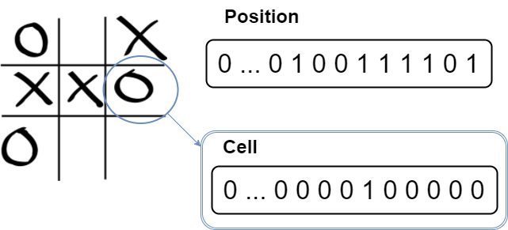

# Handling coordinates

We have just seen that a cell can be defined by the **position of the bit** on the bitboard. In fact, by using bitboards you will need to deal with three different coordinates:
* **Bit position**
* **Cartesian coordinates** (x,y)
* **One-hot vector***

# Cartesian coordinates (x,y)

We have already talked about it in the previous chapter, so we will just show how can we make conversion from (x,y) to bit position and vice versa.

## Bit position conversion

The formula is quite simple and is highly used when working with 1D vector instead of 2D arrays.

```math
\begin{equation}
  \tag{Cartesian to bit position}
  bitpos = y * W + x
\end{equation}
```

Alternatively, we can deduce the cartesian coordinates from the bit position. The following formula is the direct inverse of the above:

```math
\begin{equation}
  \tag{Bit position to cartesian}
    \left \{
    \begin{array}{l l l}
      x  & = & bitpos & \mod & W \\
      y  & = & bitpos & \div & W
    \end{array}
    \right .
\end{equation}
```

At this point we know all the necessary conversions from bit position to (x,y) coordinates. We can now begin to write our engine methods.

# One-hot vector

We call a "**one-hot vector**" a group of bits with a single high (1) bit and all the others low (0). 



This type of vector is often used to represent a single state in state-machines.

> _Then it's not like a bitboard ?_

Yes, but with an additional constraint: only one bit is high (1). It will be pretty confusing up to the end of the tutorial, so be very careful when you handle **position (bitboard)** and **cells (one-hot vector)**.

# Swap specific case: one-hot vector

In reality, if the bitboard you are dealing with is a **one-hot vector** representing a cell, or a single entity on the board for example, you can get the same result by **simply shifting** the bitboard.

Considering the above example, you get the same result with: `hero.position >>= 1`.

```C++
void moveHeroLeft(Hero * hero) {
    hero.position >>= 1;
}
```

How does it works with other relative position ? A picture speaks a thousand words:


In the above illustration, the **minus** sign `-` is a **right shift** and the **plus** sign `+` is a **left shift**.

So how should we make our hero move up ? Here it is:

```C++
void moveHeroUp(Hero * hero) {
    hero.position >>= WIDTH;
}
```
